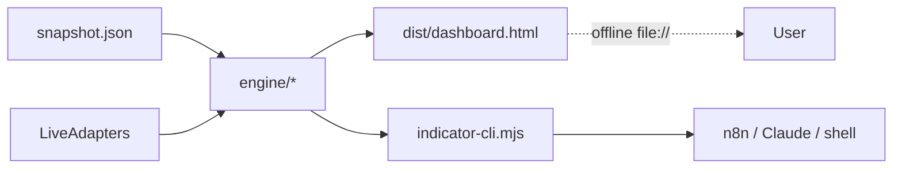

# Pelosi Tracker — Project Roadmap (Prototype, ~$0/mo)

## Context

Personal Pelosi Tracker: a profitability indicator on Nancy/Paul Pelosi's
STOCK Act disclosures plus an interactive offline artifact to "compete with
her," runnable by your own agents. Optimized for **minimum cost** ($0/mo on
free tiers + self-hosting) and reusing existing open-source agents/MCPs
instead of reinventing.

## Honest framing

Uses only public STOCK Act disclosures — legal, what NANC/KRUZ ETFs already
commercialize. The hard truths baked into the design: amount **ranges** not
exact dollars, **~45-day disclosure lag**, options/LEAPS P&L unmodelable from
ranges. The copy-trade backtest enters on the *disclosure date* — the
realistic version.

## Cost ledger (target: $0/mo)

| Layer | Free choice | Cap | Paid escape hatch |
|---|---|---|---|
| Dashboard hosting | `file://` local OR GitHub/Cloudflare Pages / Vercel free | Unlimited static | Vercel Pro $20/mo |
| n8n automation | **Self-hosted Docker** ([n8n AI Starter Kit](https://github.com/n8n-io/self-hosted-ai-starter-kit): n8n + Postgres + Ollama + Qdrant) | None | n8n Cloud ~$24/mo |
| LLM for n8n agents | **Groq free** (30 RPM, 14,400 req/day) OR **Ollama** local OR Gemini free OR OpenRouter $5 trial credit | Generous | Groq paid $0.05/M tok |
| Congressional data | **FMP free** (250 cal/day) + `disclosures-clerk.house.gov` raw XML + Quiver free tier | Daily | FMP $29/mo, Quiver $25/mo |
| Stock prices | **Stooq** (free, no key, daily OHLCV) + Alpha Vantage free (25/day) + Finnhub free (60/min) + FCS (500/mo) | Daily-bar fine | Polygon $29/mo |
| Notifications | Telegram bot, Discord webhook, Slack free, SMTP | Unlimited | — |
| MCPs (consumed) | Alpha Vantage MCP, Financial Datasets MCP, TradingView MCP, MaverickMCP | — | — |
| Scraping fallback | Apify free tier (~$5 credit/mo) | Light | Apify $49/mo |

**Total prototype run-rate: $0/mo.** House Stock Watcher's free API is **dead**
in 2026 — confirmed in research; do not depend on it.

## External integrations folded in

Consumed, not rebuilt. Wired up in Phase 5.

**MCP servers** (drop-in for Claude Desktop/Code; n8n calls via HTTP Request Tool):
- **Alpha Vantage MCP** — real-time + historical, 50+ TA indicators ([mcp.alphavantage.co](https://mcp.alphavantage.co/))
- **Financial Datasets MCP** — income/balance/cash flow, prices, news ([financial-datasets/mcp-server](https://github.com/financial-datasets/mcp-server))
- **TradingView MCP** — 30+ TA tools, Bollinger, candlesticks ([atilaahmettaner/tradingview-mcp](https://github.com/atilaahmettaner/tradingview-mcp))
- **MaverickMCP** — personal portfolio analysis ([wshobson/maverick-mcp](https://github.com/wshobson/maverick-mcp))
- Catalog: [awesome-mcp-servers/finance--crypto](https://github.com/TensorBlock/awesome-mcp-servers/blob/main/docs/finance--crypto.md)

**Open-source references**:
- [`jeremiak/us-senate-financial-disclosure-scraper`](https://github.com/jeremiak/us-senate-financial-disclosure-scraper) — Senate scraper reference
- House Clerk **FD.zip** XML (canonical, free)

**Agent surfaces**: Telegram bot, Discord webhook, Slack — standard n8n nodes, free.

## Phased roadmap

Each phase ends with a runnable artifact. Skip-friendly — Phase 2 alone
satisfies "interactive artifact"; Phase 4 alone satisfies "n8n agent library."

### Phase 0 — Foundation (~half day, $0) ✅ this commit

Repo skeleton: `package.json` (type:module, zero deps), `.gitignore`,
`README.md`, `OVERVIEW.md`, `ROADMAP.md`. Cost-ledger in `OVERVIEW.md`.

### Phase 1 — Indicator Engine + CLI (~1 day, $0)

`src/engine/` pure ES modules, zero deps, deterministic:
- `brackets.js` — STOCK Act amount brackets + midpoint position sizing.
- `pnl.js` — realized/unrealized P&L, cost basis, equity curve.
- `performance.js` — alpha vs SPY, win rate, disclosure-lag stats.
- `indicator.js` — `pelosiProfitIndicator()` → 0–100 composite + grade.
- `backtest.js` — `copyTradeBacktest()` entering on **disclosure date**.
- `technical.js` — SMA, EMA, RSI, MACD, Bollinger.

`src/cli/indicator-cli.mjs` → JSON to stdout for agents.
`test/engine.test.mjs` — `node --test`.

Plus seed `src/data/snapshot.json` (curated Pelosi PTRs + SPY + per-ticker prices).

### Phase 2 — Offline Dashboard Artifact (~1–2 days, $0)

`src/dashboard/` (template.html, styles.css, app.js, vendored
`vendor/chart.umd.min.js` — **no CDN**). `tools/build.mjs` (Node stdlib only)
resolves the engine import graph, inlines modules + CSS + Chart.js + snapshot
JSON → one `dist/dashboard.html` that works fully offline via `file://`.

Sections: **PPI gauge**, equity curve vs SPY, trade timeline, ticker
leaderboard, equity-vs-options split, disclosure-lag analytics, **copy-trade
backtest simulator**.



### Phase 3 — Live Data Adapters (~1 day, $0)

`src/data/adapters/` with Offline/Live switch. Adapters:
- Congressional: FMP free, Quiver free, House Clerk XML.
- Prices: Stooq, Alpha Vantage, Finnhub.

Missing key → silent fall-back to snapshot. Live toggle in dashboard header
and `--live` CLI flag.

### Phase 4 — n8n Workflow Library (~2 days, $0)

`docker-compose.yml` from the n8n AI Starter Kit. Default LLM credential
templates for **Groq free** + **Ollama local**.

12 hand-crafted **masters** (verified parameter blocks copied from real
examples in `n8n-docs/docs/_workflows/`) + `tools/gen-workflows.mjs` fans out
**~60 categorized variants** (fresh UUIDs, unique node names, validated
connections, Sticky Note for required creds).

| Category | Count | Pattern |
|---|---|---|
| Congressional / Pelosi tracking | 12 | Schedule → HTTP (adapter) → Code → IF new → notify |
| Technical indicators (RSI/MACD/SMA/EMA/BBands) | 18 | Schedule → HTTP price → Code → IF threshold → notify |
| News & sentiment | 10 | RSS/HTTP → Filter → AI Agent (Groq/Ollama) → notify |
| Options flow | 8 | Schedule → HTTP → Code → IF → notify |
| Bonds / macro | 8 | Schedule → HTTP → Code → IF → notify |
| Portfolio / alert utilities | 12 | Webhook/Schedule → HTTP → Code → Merge → notify; one Execute-Command master shells our CLI |
| Master AI assistant | 4 | Chat Trigger → AI Agent ← (Chat Model, Memory, HTTP Request Tool calling our CLI + consumed MCPs) |

Conservative `typeVersion`s pinned (target n8n ≥ 1.6x), documented in `n8n/README.md`.

### Phase 5 — MCP & Agent Integrations (~half day, $0)

`OVERVIEW.md` "Integrations" section with copy-paste config blocks for the
user to add Alpha Vantage MCP, Financial Datasets MCP, TradingView MCP,
MaverickMCP to `~/.claude/mcp.json` (or equivalent). A demo n8n workflow
exercises Execute Command + HTTP Request Tool against an external MCP.

### Phase 6 — Stretch / future ($0–$20/mo if pushed)

Multi-member comparison, sector allocation, deploy to Cloudflare/GitHub Pages,
optional self-built MCP server wrapping our engine via `mcp-toolbox`, paid
tiers only if free limits hit.

## Final repo structure (end of Phase 5)

```
AI-Trading/
├── README.md  OVERVIEW.md  ROADMAP.md  docker-compose.yml  package.json
├── src/
│   ├── engine/   brackets|pnl|performance|indicator|backtest|technical + index.js
│   ├── data/snapshot.json  data/adapters/{congress-*,price-*}.js + index.js
│   ├── cli/indicator-cli.mjs
│   └── dashboard/  template.html, styles.css, app.js, vendor/chart.umd.min.js
├── tools/  build.mjs  gen-workflows.mjs
├── n8n/   masters/  generated/  variants.json  README.md
├── dist/  dashboard.html   ← the offline artifact
└── test/  engine.test.mjs
```

## Verification gates

- **End of Phase 1:** `npm test` green; CLI prints valid JSON.
- **End of Phase 2:** `npm run build` writes `dist/dashboard.html`; opening
  with wifi off renders gauge, charts, and the backtest simulator.
- **End of Phase 3:** with `FMP_API_KEY` set, live fetch refreshes one ticker;
  no key → silent snapshot fall-back.
- **End of Phase 4:** `npm run gen:workflows` reports `OK: 72/72 valid`. User
  imports 1 master to confirm `typeVersion` compatibility.
- **End of Phase 5:** `OVERVIEW.md` has MCP install snippets; one demo
  workflow exercises Execute Command + HTTP Request Tool to an external MCP.

## Out of scope

- Live import-testing of every n8n workflow (no n8n here; user side).
- Hosting beyond `file://` and free static (Phase 6).
- Touching `mcp-toolbox` / `superpowers` repos (Phase 6 only).
- Investment advice. None of this is.
